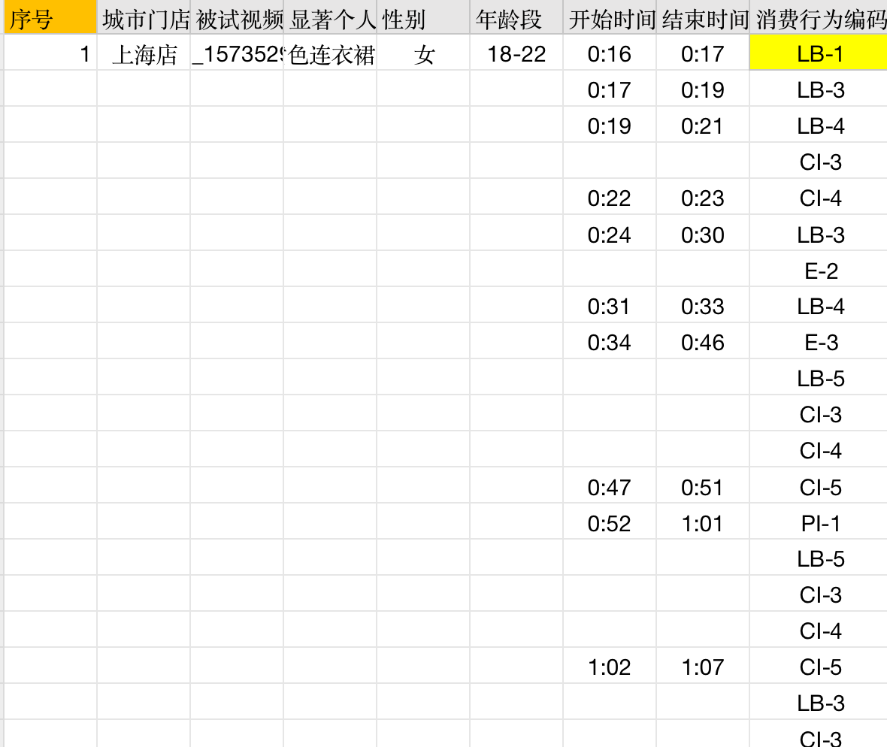
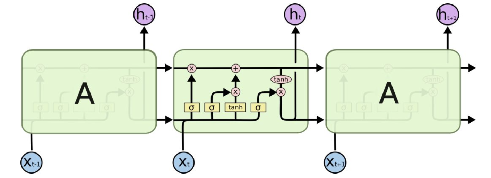

# 时序消费行为序列建模与预测
本项目将消费者的一个整体连续性消费行为分解为一系列随时间步的消费行为编码链，然后对消费者的消费行为习惯进行聚类，对于每一个类别，利用RNN、LSTM、Transformer等适用于序列数据的神经网络模型来建模此类消费者的消费行为编码过程，以达到预测此类消费者消费行为的目的，这是一个典型的基于“多变量时序数据的预测问题”。

本项目所使用的神经网络模型被赋予了“自预测”模型的含义：
- 基于前面已知的部分编码链综合信息预测下一个编码类别。
  
同时其也需要考虑时间变量因素对消费行为的影响：
- 当前时刻发生的消费行为也与时间息息相关，例如开始时刻的消费行为和结束时刻的消费行为是确定的。

## 消费行为的编码与预测建模
### 消费行为编码

  
  
<strong><em>原始数据截图</em></strong>

- 消费者在每一个时间段可能发生多个消费行为，每个消费行为都是51种的可能的行为之一，因此与传统的one-hot向量编码不同，我们将每一个时间步的消费行为编码为一个51维的指示向量，$indicate=[a_0, a_1, \ldots, a_{50}]$，$a_c \in \{0,1\}$，且$a_c为1$代表着第$c$类消费行为正在发生。
- 对于每个被试样本，最终的数据表现形式为$sample_j=[indicate_0,\ldots,indicate_{sequence\_length\_of\_j}]$
### 预测建模
考虑样本$sample_j$，在第i个的时间步数，模型应该综合前面的已知的样本类别$sample_j[:i],0 \leq i < sequence\_length\_of\_j$，预测当前时间步对应的消费行为指示向量$indicate_i$，这是一个典型的基于时间的seq2seq模型，由于原始输入和预测输出都是同一组数据，因此又是一个自预测的模型。

## 消费行为的预测模型
### 输出的损失函数
考虑到模型在每个时间步数的输出需要与对应的指示向量做损失，而指示向量可以看做是一个多标签的二分类的问题，即有51个类别需要进行判断，因此可以使模型最后的输出同样为一个一个51维的向量，采用sigmoid激活函数将输出值映射到0到1之间，此时损失函数可以采用二元交叉熵损失。
### [LSTM](https://mp.weixin.qq.com/s?__biz=MzUyODk0Njc1NQ==&mid=2247483926&idx=1&sn=8cb4861ad6f4a56f8f233c322ebcc5b3&chksm=fa69c13acd1e482ca143d21d476c4f7242a1e438c3a9103fe0931ee18b528176e5c765fa8678&scene=27)

### Transformer
