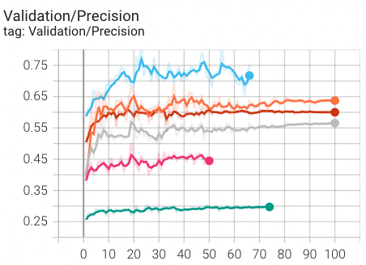

# 时序消费行为序列建模、预测和生成
本项目将消费者的一个整体连续性消费行为分解为一系列随时间步的消费行为编码链，然后对消费者的消费行为习惯进行聚类，对于每一个类别，利用RNN、LSTM、Transformer等适用于序列数据的神经网络模型来建模此类消费者的消费行为编码过程，以达到预测此类消费者消费行为的目的，这是一个典型的基于“多变量时序数据的预测问题”，之后利用逐步预测扩充时序链条的思想将“预测问题”转化为一个”生成问题“，最终生成一条代表一类消费者消费行为的任意长度的时序编码链。

## 消费行为的编码与预测建模
### 消费行为编码
<div align="center">
  
  <div align="center" ><strong><em>原始数据截图</em></strong></div>
</div>

- 消费者在每一个时间段可能发生多个消费行为，每个消费行为都是51（num-classes）种的可能的行为之一，因此与传统的one-hot向量编码不同，我们将每一个时间步的消费行为编码为一个51维的指示向量，$indicate=[a_0, a_1, \ldots, a_{50}]$，$a_c \in \{0,1\}$，且$a_c为1$代表着第$c$类消费行为正在发生。
- 对于每个被试样本，最终的数据表现形式为$sample_j=[indicate_0,\ldots,indicate_{sequence\_length\_of\_j}]$
### 预测建模
考虑样本$sample_j$，在第i个的时间步数，模型应该综合前面的已知的样本类别$sample_j[:i],0 \leq i < sequence\_length\_of\_j$，预测当前时间步对应的消费行为指示向量$indicate_i$，这是一个典型的基于时间的seq2seq模型，由于原始输入和预测输出都是同一组数据，因此又是一个自预测的模型，所使用的神经网络模型被赋予了“自预测”模型的含义：
- 基于前面已知的编码链综合信息预测下一个编码类别。
  
同时其也需要考虑时间变量因素对消费行为的影响：
- 当前时刻发生的消费行为也与时间息息相关，例如开始时刻的消费行为和结束时刻的消费行为是确定的。
  
具体来说，其形式化输入与输出如下：
#### 输入
输入由两部分拼接而成
- "滑动窗口"：采用滑动窗口来控制模型基于历史信息的输入。
  
  自回归模型（AR）的基本思想是：一个时间点的标签值可以由其过去某个时间段内的所有标签值的线性组合表示:<center>
  $Y_t=c+\varphi_1 Y_{t-1}+\varphi_2 Y_{t-2}+\ldots+\varphi_p Y_{t-p}+\xi_t$
  </center>

  其中，p代表所使用的时间滞后的数量（又称lags）。$Y_{t}$表示在时间点t的时间序列值，也就是在时间点t时的标签（训练时这里使用真实标签，预测时为输出预测标签）。$c$表示模型的常数项，也叫做截距项，在某些情况下，这个值可能被设置为0，使得模型不包含常数项。

  本项目引入"滑动窗口"（look_back）的概念，将前$look\_back$时刻的$indicate$向量拼接起来作为模型的输入。如果前$look\_back$不一定全部存在，则补充缺失的全0向量作为弥补。

- "时间嵌入"：对于每个序列长度为$sequence\_length\_of\_j$被试样本$sample_j$，在每一时刻引入一个时间编码：对于所有的数据，采用的一个固定大小的查询字典，将$t\in \{0,1,\ldots,sequence\_length\_of\_j-1\}$映射到一个$time_embedding$维度的向量。
#### 输出
对于当前时间步对应的消费行为指示向量$indicate_i$，模型输出一个51维度的概率值，每个维度的概率值$p$在0到1之间，代表着此类消费行为存在的可能性，一般来说大于0.5（$threshold$）即代表着存在。

由于同一时刻大于0.5（$threshold$）的数目可能很多，项目中引入$max\_selected$的概念，代表着每一时刻最多可能同时出现的消费行为数目，最终消费行为数目应该$\in \{1,2,\ldots,max\_selected\}$。
​


## 消费行为的预测与输出模型结构
### 基础模型
本项目采用RNN、LSTM、Transformer等适用于序列数据的神经网络模型来建模消费者的消费行为编码过程。
#### [LSTM](https://mp.weixin.qq.com/s?__biz=MzUyODk0Njc1NQ==&mid=2247483926&idx=1&sn=8cb4861ad6f4a56f8f233c322ebcc5b3&chksm=fa69c13acd1e482ca143d21d476c4f7242a1e438c3a9103fe0931ee18b528176e5c765fa8678&scene=27)


##### [LSTM的梯度传导是从t+1传导至t时刻](https://www.cnblogs.com/sumwailiu/p/13623985.html)

#### Transformer （暂时未实现）
### 分类头
<div align="center">
  
</div>

每一时刻基础模型的输出(大小为hidden_dim的向量)和当前时刻的原始输入被送入51个分类头，每个分类头最终都是经过一个sigmoid函数映射到一个0到1之间的概率值$p$.
### 输出的随机性
为了模拟输出的一定的随机性，在某一时刻大于0.5的消费行为数量大于$max\_selected$后，前$max\_selected-1$个消费行为按照最大概率从高到底选取，最后一个消费行为按照剩余所有的消费行为（除去之前已经被选择的几个外）的概率大小进行随机选取，概率越大，选取的可能性越大。

### 输出的损失函数
考虑到模型在每个时间步数的输出需要与对应的指示向量做损失，指示向量可以看做是一个多标签的二分类的问题，即有51个类别需要进行判断，但是每一个指示向量只有$max\_selected$个1，其余都为0，此时正负样本不平衡，并且有些样本难以分类，有些样本容易分类，因此采用<font color="red">focal_loss</font>作为模型的损失函数，其表达式为:

<center>

$FL\left(p_t\right)=-\alpha_t\left(1-p_t\right)^\gamma \log \left(p_t\right)$

$p_t=\left\{\begin{array}{cc}p & \text { if } y=1 \\ 1-p & \text { otherwise }\end{array}\right.$

$\alpha_t=\left\{\begin{array}{cc}\alpha & \text { if } y=1 \\ 1-\alpha & \text { otherwise }\end{array}\right.$
</center>

其中$\alpha_t$被用来控制正负样本损失平衡，$\gamma$被用来控制样本难以分类程度。

### 消费行为的输出模型
在定义了上述预测模型后，选择模型中效果最好的（即recall、precision和F1整体最好）作为输出模型，其输出过程为（由$sequence\_length$来控制最终的长度）：

在生成了前t-1个时刻的消费行为链后$[indicate_0,\ldots,indicate_{t-1}]$，预测下一个$indicate_{t}$后，将其添加到上述链条中，直到达到预定的长度$sequence\_length$。


## 使用方法
### 参数说明
- num-classes:消费行为编码大小
- class-num：哪一种消费行为
- max-time：时间嵌入字典最大大小
- time-embedding：时间嵌入维度
- look_back：滑动窗口大小
- include_time：是否包含时间
- hidden-dim：基础模型的最终输出维度
- num-layers：基础模型的堆叠层数
- alpha：正负样本调节因子
- gamma：难易样本调节因子
- max-selected：最大选取数模
- ckpt：生成时指定的模型的路径
- gpu：gpu设备号码
- sequence_length：生成链条长度
- add_random：增加随机性
### 训练
```bash
python train.py --num-classes 51 --class-num 0 --max-time 60 --time-embedding 128 --look-back 6 --include-time --hidden-dim 128 --num-layers 1 --alpha 0.8 --gamma 2.0 --max-selected 4
```
训练后会自动在log目录和ckpt_dir目录保存日志和模型检查点。
### 生成
```bash
 python generate.py --ckpt ./ckpt_dir/20231103-102001 --gpu 0 --sequence_length 10 --add_random
 ```
## 实验结果
### 预测
#### alpha
取0.8左右时候综合表现最佳

---
- <span style="color:rgb(204, 51, 17)">0.1</span> 
- <span style="color:rgb(51, 187, 238)">0.4</span>
- <span style="color:rgb(255, 112, 67)">0.6</span>
- <span style="color:rgb(192, 192, 192)">0.7</span>
- <span style="color:rgb(238, 51, 119)">0.8</span>
- <span style="color:rgb(0, 153, 136)">0.92</span>
---
<div style="display: flex;">
  
  
  
</div>

#### gamma等其他实验结果用tensorboard查看log目录文件
最终实验结果为: 
- look_back越大越好，当大约6时提升不明显。
- hidden_dim、time_embedding、num-layers影响不大
- 包含时间维度会有更好的效果
- 模型分类头增加隐藏层起反作用
- 分类头额外输入很有必要
- 相对于只有原始数据的输入，时序基础模型的补充输入能给分类头带来零点几到1左右提升
- max_selected为4最好，越低会提高精度，但是总体效果下降
### 生成
<div style="display: flex; justify-content: space-between;">
    
    
</div>
  <div align="center" ><strong><em>两个引入随机性的长度为10的链条</em></strong></div>


## 参考链接
 1. [时间序列模型：原理与应用](https://www.zhihu.com/column/c_1662768315071352832)